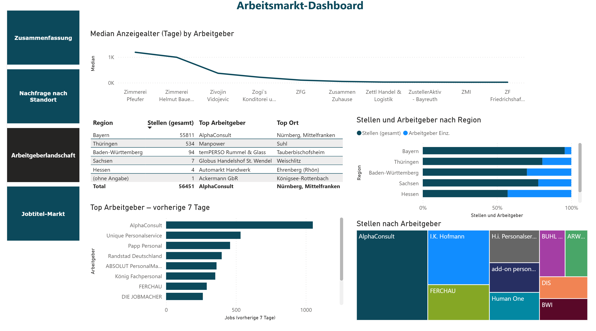
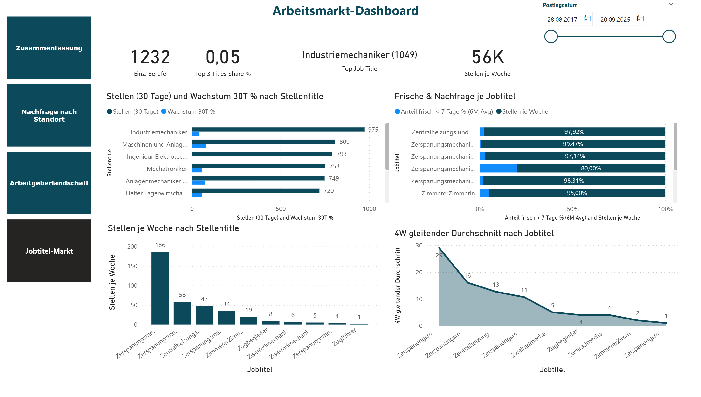

# Germany Data-Jobs Market Pulse: HR Analytics Dashboard

  

**TL;DR** — Pull live postings from the German Federal Employment Agency, standardize & enrich them (titles, employers, PLZ→city/region), and deliver a **Power BI** dashboard that shows **where/what to hire**: demand hotspots, active employers, posting freshness, and 30-day growth by job title.

**Tech**: Python (Pandas, Requests) • Power Query (ETL) • Power BI / DAX  
**Data**: Bundesagentur für Arbeit (BA) Jobsuche API — public job postings (credit BA)  
**Repo map**: [`notebooks/`](notebooks) • [`powerbi/`](powerbi) • [`assets/`](assets)

---

## Table of Contents
- [Background](#background)
- [Dataset](#dataset)
- [Methodology](#methodology)
- [Key Findings](#key-findings)
- [How to Reproduce](#how-to-reproduce)
- [Deliverables](#deliverables)
- [Business Recommendations](#business-recommendations)

---

## Background
Recruiting teams need a **weekly pulse** on the market: which **titles** are hot, which **employers** are most active, and which **regions (PLZ/city)** are spiking. This project turns raw postings into **actionable recruiting moves**—where to focus outreach, which roles to promote, and how to time efforts using **freshness** (share of postings <7 days).

---
### Business Question
Where is demand for data-relevant roles concentrated in Bamberg and its surrounding region (within 100 km) — across employers, job titles, and posting freshness — and what should HR prioritize to fill pipelines efficiently?

---

## Dataset
- **Source**: Bundesagentur für Arbeit (German Federal Employment Agency) – **Jobsuche/Jobbörse** API (public).  
- **Entities (from model & queries)**:  
  - `bamberg_jobs_enriched`: employer, job title, PLZ, city, region, posting date, modification timestamp, derived KPIs.  
  - `Date` dimension: Date, Week, WeekStart, Year, YearWeek.  
- **Time Range**: backfill from **2017-08-28** through the current snapshot.  
- **Coverage (current snapshot)**: ~2,803 unique employers, ~9,993 active postings. 
- **Reference**: PLZ→City/Region mapping table for enrichment.

---

## Methodology
**Python (Data extraction)**  
- Connected to the Bundesagentur für Arbeit (BA) Jobbörse API (`/pc/v4/jobs`) using the demo key `jobboerse-jobsuche`.  
- Queried job postings for **Bamberg and surrounding 100 km**, including both full-time and part-time (`arbeitszeit = vz;tz`).  
- Implemented pagination to fetch up to **100 pages** with a short delay between requests (`time.sleep(0.5)`).  
- Combined responses into a single JSON structure and flattened nested objects into a DataFrame using `pandas.json_normalize`.
  
    **Data overview & validation**  
    - Inspected structure (`head`, `shape`, `info`, `describe`) and confirmed field consistency.  
    - Dropped duplicates with `drop_duplicates()` and reviewed missing values (`isna().sum()`).  
    - Identified core analytical fields: job title, occupation, employer, city, postal code (PLZ), region, and key timestamps.
    
    **Postal code (PLZ) completion**  
    - Detected cities missing postal codes (`arbeitsort.plz.isna()`).  
    - Built a **city→PLZ mapping** from valid rows (most frequent PLZ per city).  
    - Filled missing PLZs and verified the mapping coverage post-imputation.
    
    **Filtering and text standardization**  
    - Filtered the dataset to rows with complete values for: `titel`, `arbeitgeber`, `arbeitsort.ort`, `arbeitsort.region`, `arbeitsort.plz`.  
    - Defined a **`clean_title()`** function to normalize job titles:  
      - Lower-case, strip spaces.  
      - Remove gender tags (`m/w/d`, `gn`, `div`).  
      - Normalize punctuation and retain umlauts (`äöüß`).  
      - Collapse multiple spaces.  
    
    **Feature engineering**  
    - Parsed `aktuelleVeroeffentlichungsdatum`, `modifikationsTimestamp`, and `eintrittsdatum` as `datetime`.  
    - Extracted `weekday` from publication date for temporal analysis.  
    - Computed **posting age** as the difference between today’s date and publication date (`posting_age_days`).  
    - Grouped postings by **age buckets** (e.g., `<7 days`, `7–30 days`, `30–90 days`, `>90 days`) to understand market freshness.
    
    **Exploratory analysis & visualization**  
    - Ranked **top cities**, **job titles**, **occupations**, and **employers** by posting count.  
    - Calculated **top-10 employer concentration** (share of total postings).  
    - Visualized:  
      - **Distribution of job posting age** using histograms and grouped bar plots.  
      - **Postings by weekday** to highlight publishing cycles.  
      - **Correlation heatmap** between numeric features (e.g., posting age, PLZ grouping, date-derived attributes) to explore relationships between location and posting recency.  
    - Displayed summary tables showing key frequency counts and proportions.
    
    **Overall insight**  
    - Provided **key insights** on regional hiring patterns and job posting dynamics.
    
    **Outputs**  
    - Exported the flattened dataset as UTF-8 CSV (`bamberg_jobs_100km.csv`).  
    - In Power BI, the **raw fetched CSV** was re-imported and **cleaning steps were redone** to demonstrate the full preprocessing workflow interactively.

**Power Query**
  - Promoted headers, type conversions  
  - Trim/Clean spaces, removed gender markers (m/w/d, gn, gn*)  
  - Standardized employer names (GmbH, AG, SE, UG)
  - **Created custom staging column (`Titel (Anzeige)`): unified `titel` + `beruf`, handled nulls/empties, normalized casing**    
  - Removed duplicates  
  - **Merged PLZ → City/Region reference** for geographic enrichment
  - Derived columns: median posting age, Top Job Title, Top Employer, Top 3 Titles Share %  
  - Grouped by week, employer, and region  

**Modeling (Power BI)**  
- Built a **Date dimension table** using `CALENDAR()` from min/max `Postingdatum`.
- Added columns: `Week`, `WeekStart`, `Year`, `YearWeek` for time intelligence.
- Created relationships between Date and posting table.

- DAX measures:  
- **Stellen (gesamt)** – total job postings.
- **Arbeitgeber Einz.** – distinct employers.
- **Wachstum 30T %** – rolling 30-day growth rate.
- **Median Anzeigealter (Tage)** – median posting age.
- **Anteil frisch <7 Tage %** – share of postings younger than 7 days.
- Supporting measures:
  - `Jobs letzte 7 Tage`, `Jobs letzte 7 Tage (Prev)` – week-over-week comparison.
  - `4W gleitender Durchschnitt` – 4-week rolling average.
  - Share of Top 3 Job Titles.

**Visualization (Power BI Pages)**  
- **Zusammenfassung** — KPIs, growth trends, region share  
- **Nachfrage nach Standort** — map by PLZ/city + title slicer  
- **Arbeitgeberlandschaft** — employer drilldowns + activity by region  
- **Jobtitel-Markt** — postings/week, freshness, rolling averages  

  
  
  
  

---

## Key Findings

## From Python (Jupyter Notebook)

### Data Scope
- Collected approximately 10,000 live job postings from the German Federal Employment API.
- Geographic focus: around 100 km radius of Bamberg, primarily covering Franconia and Northern Bavaria.

### Demand by Location
- Nürnberg (Mittelfranken) is the main hotspot (~1,300 postings), followed by Bamberg (~1,100) and Erlangen (~850).
- Secondary clusters include Forchheim, Bayreuth, Würzburg, Fürth, Höchstadt a.d. Aisch, Hirschaid, and Coburg.
- Interpretation: Demand is concentrated along the Franconian manufacturing and logistics corridor.

### Roles in Demand
- By occupation: Verkäufer/in, Gabelstaplerfahrer/in, Maschinen- und Anlagenführer/in (o. Schwerpunkt), Helfer/in – Reinigung, Industriemechaniker/in, Fachkraft – Lagerlogistik, Mechatroniker/in.
- By job title: Produktionsmitarbeiter (m/w/d), Staplerfahrer (m/w/d), Maschinenbediener (m/w/d), Produktionshelfer (m/w/d), Lagermitarbeiter (m/w/d).
- Interpretation: The job market is heavily operations-focused (production, warehouse, and technical trades). IT and administrative roles are present but form a smaller segment.

### Posting Cadence and Freshness
- Weekly postings peak in mid-September 2025 (~4,300 postings for that week).
- Weekday pattern: Most new postings appear on Monday to Wednesday; very few on weekends.
- Posting age distribution is front-loaded, with most ads aged 0–6 days and a long tail of 90+ days (likely long-open or republished postings).
- Recommended KPIs: Median posting age and share of postings under 7 days.

### Regional and Role Mix
- The majority of postings are in Bayern, followed by Thüringen and Baden-Württemberg.
- Within Bayern, production and warehouse roles dominate, aligning with the region’s industrial structure.

### Correlations
- No strong linear correlations found.
- A weak negative correlation (~-0.35) between posting age and distance from search center, likely due to recent radius expansion. Not considered decision-relevant.

## From Power BI Dashboard

### Executive KPIs (Summary Page)
- Unique employers: 2,688  
- Total active job postings: 9,964  
- 30-day job posting growth: +47.15%  
- Median posting age: 19 days  

### Top Job Titles
- Industriemechaniker is the most common job title (~1,049 postings).
- Other highly represented roles include Maschinen- und Anlagenführer, Mechatroniker, and Helfer in Reinigung or Lagerlogistik.

### Location Highlights
- Top location: Nürnberg, Mittelfranken.
- Top postal code (PLZ): 90312.
- Map visualization shows a dense concentration of job postings in Northern Bavaria and Franconia.

### Employer Landscape
- Market is fragmented but led by staffing agencies.
- Top employers (last 7 days): AlphaConsult, Unique Personalservice, Papp Personal, Randstad Deutschland, ABSOLUT Personalservice, König Fachpersonal, FERCHAU, DIE JOBMACHER.
- Regionally, Bayern dominates, followed by Thüringen, Baden-Württemberg, Sachsen, and Hessen.

### Job Freshness and Activity
- High freshness levels across most job titles, with many roles showing over 95% of postings less than 7 days old.
- Indicates fast turnover and active recruitment pipelines.

### Growth Trends
- The 30-day job growth by title shows consistent increases across industrial and technical roles.
- Overall monthly growth rate of 47% signals strong hiring momentum in the regional labor market.

## Summary Interpretation
The regional job market around Franconia and Northern Bavaria is driven by manufacturing, logistics, and production sectors. Staffing agencies play a key role in the market, posting the majority of available positions. High job freshness and strong 30-day growth indicate active recruitment cycles, especially for industrial and mechanical roles. Employers should focus sourcing efforts on Monday to Wednesday and monitor KPIs like median posting age and the proportion of recent (<7-day) listings.

---

## How to Reproduce
1. Clone the repo.  
2. **Python ingestion** (optional for refresh):  
   - Open `notebooks/jobs_market_pulse.ipynb`  
   - Run API extract → saves `data/jobs_raw.csv` → `data/jobs_clean.csv`.  
3. **Open Power BI**:  
   - Load `powerbi/germany_jobs_market_pulse.pbix`  
   - Check data source path → Refresh.  
4. Explore dashboards.

---

## Deliverables

- **Notebook:** [Germany data-jobs market pulse (HR analytics angle).ipynb](./Germany%20data-jobs%20market%20pulse%20(HR%20analytics%20angle).ipynb)
- **Dashboard:** [Germany data-jobs market Dashboard.pbix](./Germany%20data-jobs%20market%20Dashboard.pbix)
- **Assets (Charts & Visuals):**
  - [Germany Data-Jobs Market Dashboard.png](./assets/Germany%20Data-Jobs%20Market%20Dashboard.png)
  - [Arbeitgeberlandschaft.png](./assets/Arbeitgeberlandschaft.png)
  - [Jobtitel-Markt.png](./assets/Jobtitel-Markt.png)
  - [Nachfrage nach Standort.png](./assets/Nachfrage%20nach%20Standort.png)
- **Dataset:** [Bamberg_jobs_100km.csv](./Bamberg_jobs_100km.csv)

---

## Business Recommendations

## 1- Focus on Core Regions
 Prioritize recruitment and workforce planning in **Nürnberg, Bamberg, and Erlangen**, which represent the highest job posting volumes.
 Expand selectively into secondary clusters (Bayreuth, Würzburg, Fürth) to capture additional talent pools.

## 2- Target In-Demand Roles
Strengthen hiring pipelines for **Industriemechaniker, Mechatroniker, Lagerlogistik, Gabelstaplerfahrer, and Produktionsmitarbeiter** as these dominate demand.
Consider proactive training and apprenticeship programs to address shortages in production and warehouse roles.

## 3- Optimize Recruitment Timing
Schedule job postings and outreach on **Monday to Wednesday**, when employer activity is highest.
Track **median posting age** and the **share of postings under 7 days** to ensure hiring remains competitive in a fast-moving market.

## 4- Leverage Staffing Agencies
Collaborate strategically with major staffing firms (e.g., AlphaConsult, Randstad, Unique Personalservice) that drive a large share of postings.
Use agency partnerships for rapid access to labor in logistics, production, and technical trades.

## 5- Monitor Growth KPIs
Continue tracking the **30-day growth rate** (+47.15%) and **median posting age** (19 days) as leading indicators of labor market shifts.
Use Power BI dashboards to monitor role-level and region-level demand for agile workforce planning.

---
